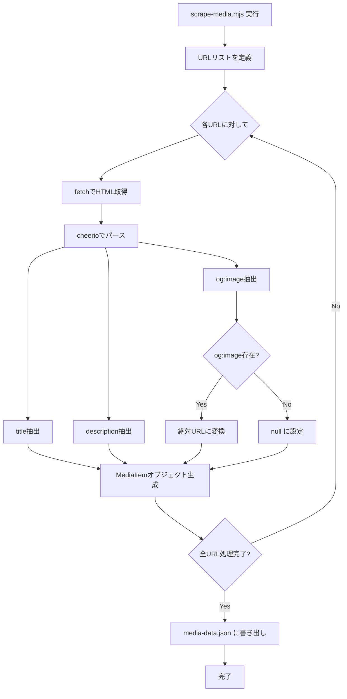
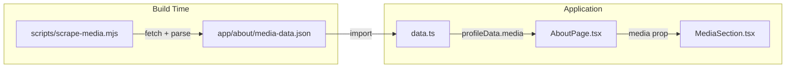

# Aboutページ Media Section 実装設計

## 1. 現在のコード構造の概要

### AboutPageの構成

[`AboutPage.tsx`](app/about/AboutPage.tsx) は、`Container` + `VStack` レイアウトで以下のセクションを縦に並べている：

```
AboutPage
├── BasicInfoCard        （プロフィール情報・所属）
├── SkillsWithDescSection （スキル一覧）
├── InterestsSection     （興味関心タグ）
└── SocialLinks          （SNSリンク）
```

### データの流れ

```
data.ts (profileData) → AboutPage.tsx → 各Section Component (props経由)
```

- [`data.ts`](app/about/data.ts) が [`Profile`](app/about/types.ts:1) 型の定数 `profileData` をエクスポート
- [`AboutPage.tsx`](app/about/AboutPage.tsx) が `profileData` をインポートし、各コンポーネントに必要なプロパティを渡す
- 各コンポーネントは props 経由でデータを受け取る（状態管理なし・純粋な表示コンポーネント）

### コンポーネントパターン

すべてのセクションコンポーネントは共通のパターンに従う：

| パターン | 詳細 |
|---------|------|
| **セクションタイトル** | `<Text textStyle="2xl" fontWeight="bold">` で統一 |
| **カードコンテナ** | `<Box borderRadius="lg" borderWidth="1px" borderColor="border.muted" bg="bg.panel" p={6}>` |
| **ホバー効果** | `_hover={{ borderColor: "border.emphasized" }}` + `transition="all 0.2s"` |
| **レイアウト** | 外側は `<VStack gap={12} align="stretch">` でセクション間を統一 |
| **UIライブラリ** | Chakra UI v3 + カスタムUIコンポーネント（`~/components/ui/`） |

### ビルド設定

- **フレームワーク**: React Router v7 + Vite
- **SSR**: 有効（Cloudflare Workers デプロイ）
- **カスタムViteプラグイン**: [`cloudflareWorkerEntry()`](vite.config.ts:8) が既に存在
- **パッケージマネージャ**: pnpm
- **ビルドコマンド**: `react-router build`

---

## 2. スクレイピングのアプローチ

### 方式: ビルド前実行のスタンドアロンスクリプト

Viteプラグインとして統合する方法もあるが、以下の理由からスタンドアロンスクリプトを採用：

- スクレイピングの失敗がビルド全体をブロックしないように制御しやすい
- デバッグや手動実行が容易
- 既存のVite設定に影響しない

### 使用ライブラリ

| ライブラリ | 用途 | 理由 |
|-----------|------|------|
| `cheerio` | HTMLパース | 軽量・高速・jQueryライクAPIでメタタグ抽出が容易 |
| Node.js 組み込み `fetch` | HTTPリクエスト | 追加依存なし（Node 18+） |

### スクレイピング対象

```json
[
  "https://www.toyo.ac.jp/interview/02903.html",
  "https://www.toyo.ac.jp/contents/gakuhou/281/",
  "https://www.iniad.org/blog/2025/06/10/post-3268/",
  "https://www.ipa.go.jp/jinzai/mitou/it/2025/gaiyou-tk-1.html"
]
```

### 取得するメタデータ

各URLから以下を抽出：

1. **タイトル**: `<title>` タグ または `<meta property="og:title">`
2. **説明**: `<meta name="description">` または `<meta property="og:description">`
3. **OG画像**: `<meta property="og:image">` （絶対URLに変換）
4. **ファビコン**: `<link rel="icon">` （カードのドメイン表示用・任意）

### スクリプトの処理フロー



### エラーハンドリング

- ネットワークエラーやタイムアウト時は、該当URLのデータをフォールバック値で出力
- フォールバック: `{ url, title: "タイトル取得失敗", description: "", ogImage: null }`
- スクリプト自体は `exit 0` で終了（ビルドをブロックしない）
- タイムアウト: 10秒/URL

---

## 3. データフロー

### 全体アーキテクチャ



### ステップ詳細

1. **ビルド時**: `pnpm build` 実行時に `scrape-media.mjs` が先に実行される
2. **JSON生成**: スクレイピング結果が [`app/about/media-data.json`](app/about/media-data.json) に書き出される
3. **データ統合**: [`data.ts`](app/about/data.ts) がJSONをインポートし、`profileData` の `media` フィールドに設定
4. **コンポーネントへ渡す**: [`AboutPage.tsx`](app/about/AboutPage.tsx) が `profileData.media` を `MediaSection` に渡す
5. **表示**: `MediaSection` がカード形式でレンダリング

### JSONファイルの形式

```json
{
  "items": [
    {
      "url": "https://www.toyo.ac.jp/interview/02903.html",
      "title": "東洋大学 インタビュー",
      "description": "学生インタビューの内容...",
      "ogImage": "https://www.toyo.ac.jp/path/to/image.jpg"
    }
  ],
  "scrapedAt": "2026-04-01T14:00:00.000Z"
}
```

### OG画像の取り扱い

- **原則**: 元のOG画像URLをそのまま使用（外部サイトの画像を直接参照）
- **フォールバック**: OG画像がない場合は [`/no-image.webp`](public/no-image.webp) を使用
- **`<Image>` コンポーネント**: Chakra UIの `fallback` プロパティでエラー時のフォールバックを設定

---

## 4. 型定義の設計

### 新規型定義（[`types.ts`](app/about/types.ts) に追加）

```typescript
/** Media Section の各カードデータ */
export interface MediaItem {
  /** リンク先URL */
  url: string;
  /** ページタイトル */
  title: string;
  /** ページの説明 */
  description: string;
  /** OG画像のURL（nullの場合はフォールバック画像を使用） */
  ogImage: string | null;
}

/** スクレイピング結果のJSONファイル形式 */
export interface MediaData {
  items: MediaItem[];
  scrapedAt: string;
}
```

### 既存型の変更（[`Profile`](app/about/types.ts:1) に追加）

```typescript
export interface Profile {
  name: string;
  avatar: string;
  affiliations: Affiliation[];
  bio: string;
  skills: SkillCategory[];
  interests: string[];
  socialLinks: SocialLink[];
  media: MediaItem[];       // ← 追加
}
```

---

## 5. コンポーネント設計

### MediaSection コンポーネント

新規ファイル: `app/about/components/MediaSection.tsx`

#### 構造

```
MediaSection
├── セクションタイトル "Media"
└── SimpleGrid (columns={2}, gap={6})
    ├── MediaCard (item[0])
    ├── MediaCard (item[1])
    ├── MediaCard (item[2])
    └── MediaCard (item[3])
```

#### MediaCard の内部構造

```
MediaCard
├── Link (外部リンク, target="_blank")
│   └── Box (カードコンテナ)
│       ├── Image (OG画像, fallback=no-image.webp)
│       └── VStack
│           ├── Text (タイトル, fontWeight="semibold")
│           └── Text (説明, color="fg.muted", lineClamp={2})
```

#### Props設計

```typescript
interface MediaSectionProps {
  items: MediaItem[];
}
```

#### スタイリング方針

既存パターンに準拠：

| 要素 | スタイル |
|------|---------|
| セクションタイトル | `textStyle="2xl"` `fontWeight="bold"` |
| カード | `borderRadius="lg"` `borderWidth="1px"` `borderColor="border.muted"` `bg="bg.panel"` |
| カードホバー | `_hover={{ borderColor: "border.emphasized", transform: "translateY(-2px)" }}` `transition="all 0.2s"` |
| 画像 | `aspectRatio={16/9}` `objectFit="cover"` `borderRadius="md"` |
| タイトル | `fontWeight="semibold"` `fontSize="md"` |
| 説明文 | `color="fg.muted"` `fontSize="sm"` `lineClamp={2}` |

#### レスポンシブ対応

- `SimpleGrid` の `columns` を `{ base: 1, md: 2 }` に設定
- モバイルでは1列、タブレット以上で2列表示

---

## 6. ファイル構成

### 新規作成ファイル

| ファイル | 説明 |
|---------|------|
| `scripts/scrape-media.mjs` | ビルド時スクレイピングスクリプト |
| `app/about/media-data.json` | スクレイピング結果（ビルド時に自動生成・`.gitignore`推奨） |
| `app/about/components/MediaSection.tsx` | Media Section コンポーネント |

### 変更ファイル

| ファイル | 変更内容 |
|---------|---------|
| [`app/about/types.ts`](app/about/types.ts) | `MediaItem`・`MediaData` 型を追加、`Profile` に `media` フィールドを追加 |
| [`app/about/data.ts`](app/about/data.ts) | `media-data.json` をインポート、`profileData` に `media` を追加 |
| [`app/about/AboutPage.tsx`](app/about/AboutPage.tsx) | `MediaSection` をインポート・追加 |
| [`app/about/index.ts`](app/about/index.ts) | `MediaSection` のエクスポートを追加 |
| [`package.json`](package.json) | `build` スクリプトの変更、`cheerio` の追加 |
| [`.gitignore`](.gitignore) | `app/about/media-data.json` を追加 |

### 依存関係の追加

```bash
pnpm add -D cheerio
```

### package.json スクリプト変更

```json
{
  "scripts": {
    "build": "node scripts/scrape-media.mjs && react-router build",
    "scrape:media": "node scripts/scrape-media.mjs"
  }
}
```

`scrape:media` は手動実行用の便利スクリプト。

---

## 7. 実装の順序（Todo List）

1. `cheerio` を devDependencies に追加
2. `scripts/scrape-media.mjs` を作成
3. `app/about/media-data.json` の初期版を手動作成（スクリプト実行で確認）
4. [`app/about/types.ts`](app/about/types.ts) に `MediaItem`・`MediaData` 型を追加
5. [`app/about/data.ts`](app/about/data.ts) に `media` データを統合
6. `app/about/components/MediaSection.tsx` を作成
7. [`app/about/AboutPage.tsx`](app/about/AboutPage.tsx) に `MediaSection` を追加
8. [`app/about/index.ts`](app/about/index.ts) にエクスポートを追加
9. [`package.json`](package.json) の `build` スクリプトを変更
10. [`.gitignore`](.gitignore) に `media-data.json` を追加
11. ビルドして動作確認
